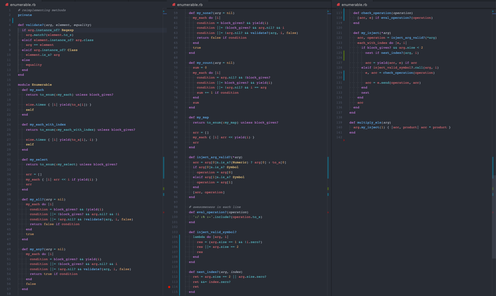

# Enumerable methods 
[![Contributors][contributors-shield]][contributors-url]

<div style="text-align: center;" >
  <a href="https://www.microverse.org">
    
  </a>
  
  <p>
    <b>Enumerable methods</b></br>
    <a href="https://ruby-doc.org/core-2.6.5/Enumerable.html"><b>Enumerable</b></a>
  </p>
</div>

Self implementation on some of the Enumerables methods
## Table of Contents

* [About the Project](#about-the-project)
* [Built With](#built-with)
* [Roadmap](#roadmap)
* [Acknowledgements](#acknowledgements)
* [Contributing](#contributing)
* [Contact](#contact)


## About The Project
This is the second ruby project on the [Microverse](https://www.microverse.org) curriculum
Here I create my own implementation of the ruby Enumerable methods



```
#my_each_with_index
#my_select
#my_all?
#my_any?
#my_none?
#my_count
#my_map
#my_inject
```

A more detailed explanation: [ruby Enumerables](https://www.theodinproject.com/courses/ruby-programming/lessons/advanced-building-blocks).


## 👨🏻‍💻Built With

* Visual Studio Code
* Ruby, Irb
* Rubocop

## ⚡New knowledge learned

* Closures
* Blocks , Procs, Lambdas, yields
* Enumerator / Enumerable
* Review of ruby fundamentals
* Clean Code Practices with Robocup

## 🎯 Road Map

This project will be extenden and refactored in the future for practice new techniques like metaprogramming and FP, in a near future, no roadmap associated.
For more information, look into the TODO commit messages.

## 🤝 Acknowledgements
* [Microverse](https://www.microverse.org/) - The opportunity of learn, meet people, breath code, and improve my life ) 
* [The Odin Project](https://www.theodinproject.com/) - For their open source curated links
* [ferdelvalle](https://github.com/ferdelvalle) -  For push me to `code for humans` and improve my code literacy

## Code reviews 

* [Mauricio Robayo](https://github.com/MauricioRobayo) - He taught me the value of double-check my code
* [Ahmed Mahfoudh](https://github.com/stratospherique) - He taught me the value of professionalism 

---
## 💡🐵 Contributing
* Fork it https://github.com/yourname/yourproject/fork
* Create your feature branch (git checkout -b feature/fooBar)
* Commit your changes (git commit -am 'Add some awesome fooBar')
* Push to the branch (git push origin feature/fooBar)s
* Create a new Pull Request

## Contact
☕ Sebastián Luján 
- [Twitter: @sebastianlujan ](https://twitter.com/gseba_lujan) 
- glujan.recalde@gmail.com

🔥 *Be 10x better*

[contributors-shield]: https://img.shields.io/github/contributors/sebastianlujan/ruby-enumerables?style=flat-square
[contributors-url]: https://github.com/sebastianlujan/ruby-enumerables/
